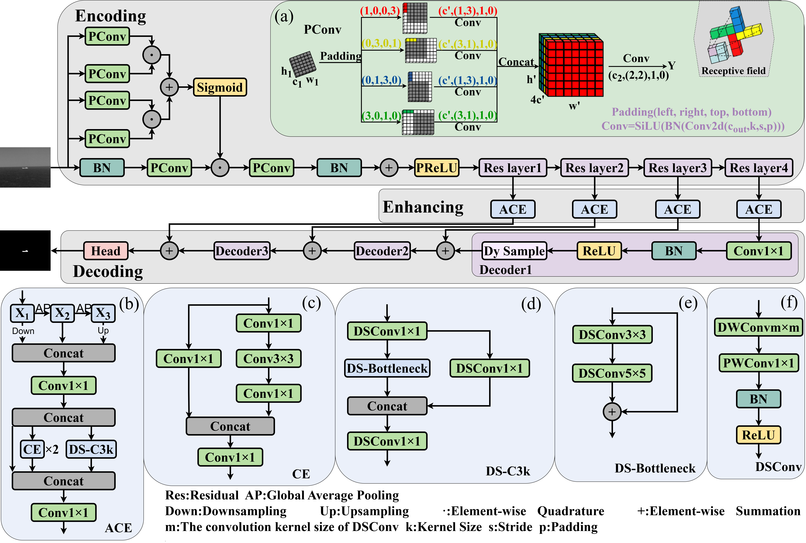

# This is the code of paper "ACEPNet：Contextual Attention Correlation Enhancement and Pinwheel Convolution Network for Infrared Small Target Detection", the full code will be made public after the manuscript is accepted.

## Model Structure

 

## Results

<table border="0" cellspacing="0" cellpadding="0" style="text-align: center;">
<tr>
<th rowspan="2">Method</th>
<th colspan="4">NUAA-SIRST</th>
<th colspan="4">NUDT-SIRST</th>
<th colspan="4">IRSTD-1K</th>
</tr>
<tr>
<th>pixAcc</th> <th>mIoU</th> <th>Pd</th> <th>Fa</th>
<th>pixAcc</th> <th>mIoU</th> <th>Pd</th> <th>Fa</th>
<th>pixAcc</th> <th>mIoU</th> <th>Pd</th> <th>Fa</th>
</tr>

<tr>
<td>SCTransNet</td>
<td>82.85</td> <td>64.93</td> <td>95.06</td> <td>82.94</td>
<td>90.36</td> <td>82.48</td> <td>97.99</td> <td>7.97</td>
<td>74.46</td> <td>65.53</td> <td>90.24</td> <td>9.01</td>
</tr>
<tr>
<td>ACM</td>
<td>77.43</td> <td>66.96</td> <td>91.63</td> <td>34.92</td>
<td>83.33</td> <td>67.56</td> <td>96.61</td> <td>12.27</td>
<td><b>83.60</b></td> <td>56.54</td> <td><b>93.27</b></td> <td>87.64</td>
</tr>
<tr>
<td>ALCNet</td>
<td>81.05</td> <td>63.52</td> <td>91.25</td> <td>35.06</td>
<td>83.07</td> <td>68.79</td> <td>96.51</td> <td>16.98</td>
<td>77.45</td> <td>53.14</td> <td>91.25</td> <td>100.9</td>
</tr>
<tr>
<td>DNA-Net</td>
<td><u>85.21</u></td> <td><u>76.55</u></td> <td>96.20</td> <td>31.56</td>
<td><u>96.15</u></td> <td><u>94.37</u></td> <td><u>99.05</u></td> <td><b>1.58</b></td>
<td>74.19</td> <td>64.27</td> <td>88.89</td> <td><u>9.41</u></td>
</tr>
<tr>
<td>UIU-Net</td>
<td>82.84</td> <td>76.42</td> <td>93.92</td> <td><b>12.21</b></td>
<td>95.21</td> <td>92.79</td> <td>98.20</td> <td>3.47</td>
<td>79.14</td> <td>63.50</td> <td>92.93</td> <td>37.56</td>
</tr>
<tr>
<td>RDIAN</td>
<td>82.15</td> <td>70.11</td> <td>93.92</td> <td>46.92</td>
<td>84.89</td> <td>77.91</td> <td>92.06</td> <td>11.79</td>
<td>74.49</td> <td>59.83</td> <td>91.92</td> <td>37.73</td>
</tr>
<tr>
<td>ISTDU-Net</td>
<td><b>86.33</b></td> <td>74.65</td> <td><u>96.20</u></td> <td>40.41</td>
<td>93.01</td> <td>88.85</td> <td>98.31</td> <td>13.10</td>
<td>75.00</td> <td>60.82</td> <td>92.59</td> <td>36.46</td>
</tr>
<tr>
<td>LCAE-Net</td>
<td>83.73</td> <td>74.50</td> <td>95.82</td> <td><u>29.02</u></td>
<td>95.32</td> <td>92.75</td> <td>98.84</td> <td>2.46</td>
<td>80.29</td> <td><u>69.90</u></td> <td>91.25</td> <td>19.83</td>
</tr>

<tr>
<td><b>ACEPNet</b></td>
<td><b>86.33</b></td> <td><b>77.12</b></td> <td><b>97.34</b></td> <td>40.47</td>
<td><b>96.20</b></td> <td><b>94.63</b></td> <td><b>99.05</b></td> <td><u>1.86</u></td>
<td><u>81.00</u></td> <td><b>70.53</b></td> <td><u>93.13</u></td> <td>16.74</td>
</tr>
</table>

## Usage

### 1.Data
The dataset, which combines IRSTD-1K,NUDT-SIRST,and NUAA-SIRST, is used to train CN-UNet.
* IRSTD-1K [download](https://github.com/RuiZhang97/ISNet) [paper](https://ieeexplore.ieee.org/document/9880295)
* NUDT-SIRST [download](https://github.com/YeRen123455/Infrared-Small-Target-Detection) [paper](https://ieeexplore.ieee.org/abstract/document/9864119)
* NUAA-SIRST [download](https://github.com/YimianDai/sirst) [paper](https://arxiv.org/pdf/2009.14530)

## Contact

**Welcome to raise issues or email to [wangxin@stu.cqut.edu.cn](wangxin@stu.cqut.edu.cn) for any question regarding our ACEPNet.**
